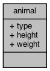
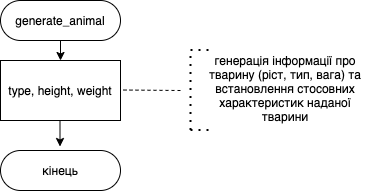
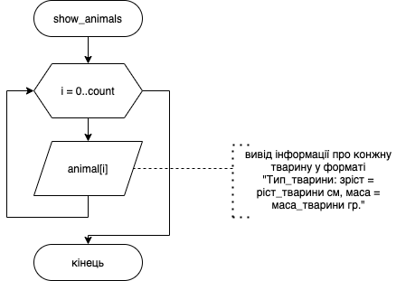
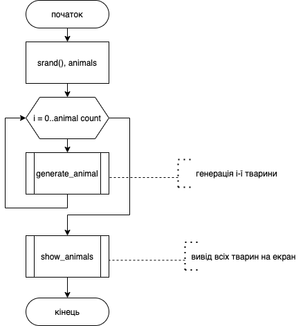

# Лабораторна робота № 1. Робота з структурованими типами даних

## 1 Вимоги

### 1.1 Розробник

* Давидов Вячеслав Вадимович;
* студент групи КІТ-24а;
* 07-січ-2021.

### 1.2 Загальне завдання

Розробити функцію, яка генерує структуру із залученням механізму випадкової генерації даних (прикладна галузь вказана в індивідуальному завданні). Розробити функцію, яка буде виводити вміст масиву структур на екран.

### 1.3 Індивідуальне завдання

Прикладна галузь «Тварина». Типи об’єктів та їх поля: тип (напр. Корова, Свиня), ріст, вага.

## 2 Опис програми

### 2.1 Функціональне призначення

Програма призначена для генерації тварин та видача їх на екран за допомогою функцій, що декларовані в файлі *stdio.h*. 

При генерації тварини діють наступні *обмеження*:

- тип тварини - один з переліку: кіт, собака, корова, свиня;
- ріст: від 0 до 255 (см);
- вага: від 0 до 255 (кг). 

Результат зберігається у змінній *animals*.

Демонстрація знайдених результатів передбачає як покрокове виконання програми в режимі налагодження, так і видача даних у вікні консолі.

### 2.2 Опис логічної структури

За допомогою ключового слова *struct* описуємо тварину, що має 3 поля – тип, ріст, вагу. Розроблено структуру, вміст якої подано нижче.



Під час генерації тварини:

- для отримання псевдовипадкого типу (в діапазоні `[0..ANIMAL_TYPE_COUNT]`) використовується наступна конструкція `(unsigned int)rand() % ANIMAL_TYPE_COUNT`;
- для отримання псевдовипадкого зрісту та ваги (в діапазоні `[0..255)`) використовується наступна конструкція `(unsigned int)rand() % INT8_MAX`.

Опис розроблених структур і функцій наводиться на базі результатів роботи системи автодокументування *Doxygen*.

#### Функція гененерації тварини 

```c
		void generate_animal(struct animal *entity)
```

*Призначення*: створення даних про тварину.

*Схема алгоритму функції* подана нижче.

*Опис роботи*: функція генерує випадковий тип, ріст, вагу та заносить їх у переданий покажчик на структуру тварини.



#### Функція відображення тварин

```c
		void show_animals(struct animal animals[], unsigned int count)
```

*Призначення*: виведення на екран вмісту масиву з даними про тварини.

*Схема алгоритму функції* подана на нижче.

*Опис роботи*: функція в циклі з масиву, що їй передається, виводить на екран дані в такій послідовності: `Тип_тварини: зріст = ріст_тварини см, маса = маса_тварини гр.`

**Аргументи**: 

- *animals* - масив з даними о тваринах, які необхідно вивести на екран;
- *count* - кількість тварин у переданому масиві.




#### Основна функція

```c
		int main() 
```

*Призначення*: головна функція.

*Схема алгоритму функції* подана на нижче.

*Опис роботи*: 

- створення масиву із `ANIMAL_COUNT` тварин;
- генерація даних для кожної тварини шляхом виклика функції `generate_animal`;
- вивід даних про всіх тварин на екран за допомогою функції `show_animals`;
- повертає функція код повернення з програми (0).




#### Структура проекту

```
		└── lab00
		    ├── .clang-format
		    ├── Doxyfile
		    ├── Makefile
		    ├── README.md
		    ├── doc
		    │   ├── assets
		    │   ├── lab00.docx
		    │   └── lab00.md
		    ├── src
		    │   ├── lib.c
		    │   ├── lib.h
		    │   └── main.c
		    └── test
		        └── test.c
```


### 2.3 Важливі фрагменти програми

#### Структура типу Animal

```c
		struct animal {
			enum animal_type type; /**< тип тварини */
			unsigned int height; /**< ріст тварини, см */
			unsigned int weight; /**< маса тварини, грам */
		};
```

#### Початкові дані. Константи, перерахування

```c
		/**
		 * Кількість тварин у масиві
		 */
		#define ANIMAL_COUNT 10

		/**
		 * Типи тварин
		 */
		enum animal_type {
			PIG, /**< Свиня */
			COW, /**< Корова */
			DOG, /**< Собака */
			CAT, /**< Кіт */
			ANIMAL_TYPE_COUNT /**< Кількість тварин */
		};
```

#### Генерація тварини

```c
		entity->height = (unsigned int)rand() % INT8_MAX;
		entity->weight = (unsigned int)rand() % INT8_MAX;
		entity->type = (unsigned int)rand() % ANIMAL_TYPE_COUNT;
```

#### Відображення i-ї тварини

```c
		printf("Інформація про тварину №%02u: ", i + 1);
		printf("%s: зріст = %u см, маса = %u гр. \n",
		       get_animal_type_name(animals[i].type), animals[i].height,
		       animals[i].weight);
```

## 3 Варіанти використання

Для демонстрації результатів кожної задачі використовується:

- покрокове виконання програми в утиліті lldb;
- видача результатів у консоль за допомогою функції виводу.

**Варіант використання 1**: послідовність дій для запуску програми у режимі відлагодження:

- запустити програму у відлагоднику lldb;
- поставити точку зупинки на функції main (строка з `return 0;`);
- запустити програму;
- подивитись результати виконання програми, оглядаючи значення змінної animals

```
		Process 3104 stopped
		* thread #1, queue = 'com.apple.main-thread', stop reason = breakpoint 1.1
		    frame #0: 0x0000000100000eb2 main.bin`main at main.c:48:2
		   45  		}
		   46  		show_animals(animals, ANIMAL_COUNT);
		   47  	
		-> 48  		return 0;
		   49  	}
		Target 0: (main.bin) stopped.
		(lldb) p animals
		(animal [10]) $0 = {
		  [0] = (type = CAT, height = 91, weight = 92)
		  [1] = (type = DOG, height = 30, weight = 79)
		  [2] = (type = COW, height = 58, weight = 60)
		  [3] = (type = CAT, height = 35, weight = 115)
		  [4] = (type = PIG, height = 115, weight = 40)
		  [5] = (type = PIG, height = 20, weight = 120)
		  [6] = (type = CAT, height = 40, weight = 90)
		  [7] = (type = DOG, height = 97, weight = 98)
		  [8] = (type = COW, height = 75, weight = 20)
		  [9] = (type = CAT, height = 7, weight = 11)
		}
```


**Варіант використання 2**: видача згенерованих студентів з використанням вікна консолі.

```
		Інформація про тварину №01: Корова: зріст = 104 см, маса = 118 гр. 
		Інформація про тварину №02: Свиня: зріст = 114 см, маса = 70 гр. 
		Інформація про тварину №03: Корова: зріст = 1 см, маса = 58 гр. 
		Інформація про тварину №04: Собака: зріст = 35 см, маса = 76 гр. 
		Інформація про тварину №05: Корова: зріст = 102 см, маса = 25 гр. 
		Інформація про тварину №06: Свиня: зріст = 46 см, маса = 34 гр. 
		Інформація про тварину №07: Собака: зріст = 40 см, маса = 13 гр. 
		Інформація про тварину №08: Кіт: зріст = 60 см, маса = 118 гр. 
		Інформація про тварину №09: Свиня: зріст = 29 см, маса = 30 гр. 
		Інформація про тварину №10: Корова: зріст = 68 см, маса = 88 гр.
```

## Висновки

При виконанні даної лабораторної роботи було набуто практичного досвіду роботи із структурованими типами даних типу struct, передачі структур та масивів структур в якості аргументів функції, а також їх повернення з функцій.
